# Quiz Arena — Diagramas UML

Suíte completa de diagramas UML do Quiz Arena, escrita em **PlantUML** (blocos
```` ```plantuml ````, renderizados pelo plugin do Obsidian).

> [!important] Origem e precedência
> Os diagramas foram transcritos de duas fontes, nesta ordem:
>
> 1. **`fluxograma.png`** — a fonte da verdade do produto (as caixas do Script Diário,
>    a ordem peso → ranking → sorteio, o bloco vermelho "TODO: ignorar por enquanto").
> 2. **O código** (`server/`, `src/`) — nomes reais de função, campos reais do Firestore.
>
> Se um diagrama contradizer o código, o diagrama está errado. Se contradizer o
> fluxograma, o código está errado — e isso precisa ser dito em voz alta, não
> resolvido em silêncio. Detalhes: `AGENTS.md` e `Quiz Arena — Documentação.md`.

## Índice

| # | Diagrama | Tipo | O que fixa |
| --- | --- | --- | --- |
| 1 | [Casos de uso](#1-casos-de-uso) | `usecase` | Fronteira do sistema e as caixas do fluxograma |
| 2 | [Modelo de domínio](#2-modelo-de-domínio--documentos-do-firestore) | `class` | Documentos do Firestore e suas invariantes |
| 3 | [Componentes do backend](#3-componentes-do-backend) | `class` | As camadas `routes → services → repositories → Firestore` |
| 4 | [Modelo do frontend](#4-modelo-do-frontend) | `class` | Componentes React e o contrato espelhado da API |
| 5 | [Sessão: entrar ou criar](#5-sessão-entrar-ou-criar) | `sequence` | `POST /api/auth/entrar` |
| 6 | [Rodada do dia](#6-rodada-do-dia) | `sequence` | `GET /api/quiz/rodada` |
| 7 | [Resposta a uma questão](#7-resposta-a-uma-questão) | `sequence` | `POST /api/quiz/respostas` e as duas fases de pontuação |
| 8 | [Motor de word match](#8-motor-de-word-match) | `activity` | `casarPorWord` + `melhorAlternativa` |
| 9 | [Script Diário](#9-script-diário--às-00h00) | `sequence` | Ordem obrigatória peso → ranking → sorteio |
| 10 | [Peso dinâmico](#10-peso-dinâmico-por-raridade) | `activity` | Fórmula de `calcularPeso` |
| 11 | [Ciclo de vida da rodada](#11-ciclo-de-vida-da-rodada) | `state` | Estados da tela e do dia no Firestore |
| 12 | [Componentes do sistema](#12-componentes-do-sistema) | `component` | As três zonas do fluxograma |
| 13 | [Implantação](#13-implantação) | `deployment` | Dev, produção e o cron |

## Legenda de notação

- `«interface»` contrato; `«middleware»` função que intercepta requisição;
  `«repository»` único lugar que toca o Firestore; `«service»` regra de negócio.
- `<<repository>>` marca o único lugar que toca o Firestore; `<<service>>`, regra de
  negócio; `<<router>>` e `<<middleware>>`, a camada HTTP.
- `<<include>>` sempre executado; `<<extend>>` condicional.
- Rótulo `⚠️` marca armadilha conhecida do repositório (ver `AGENTS.md`).

---

## 1. Casos de uso

O quadrante "Frontend Vite" e o quadrante "Backend Vite" do fluxograma, com os
atores reais: o jogador, o agendador das 00h00 e quem opera o servidor.

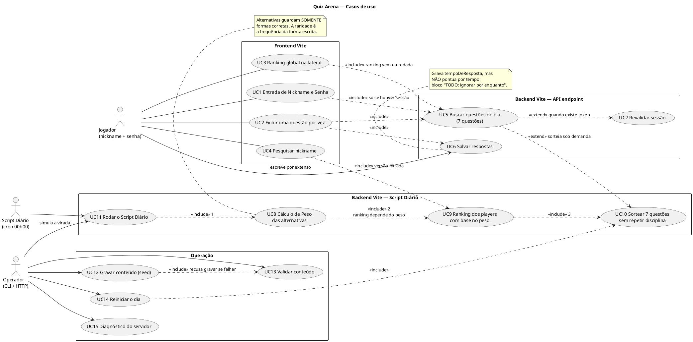

> [!warning] A ordem de `UC11` não é preferência
> O fluxograma liga Script Diário → Peso → Ranking → Sorteio com **setas de
> dependência**, não de lista de tarefas. `UC9` lê os pontos que `UC8` acabou de
> reescrever; reordenar quebra o cálculo.

---

## 2. Modelo de domínio — documentos do Firestore

Uma classe por documento. Os nomes das propriedades são exatamente os campos gravados
pelo backend, e a composição reproduz o caminho real das subcoleções.

```plantuml
@startuml
!pragma layout elk
title Quiz Arena — Modelo de domínio (documentos do Firestore)
skinparam classAttributeIconSize 0
skinparam shadowing false

package "disciplinas/ (conteúdo, gravado pelo seed)" {
  class Disciplina {
    +id: string <<chave=slug>>
    +nome: string
    +descricao: string
    +ativa: boolean
    +criadaEm: Date?
    +atualizadaEm: Date?
  }

  class Questao {
    +id: string <<chave=slug>>
    +disciplinaNome: string
    +enunciado: string
    +destaque: string
    +categoria: string
    +selecionada: boolean
    +ativa: boolean
    +criadaEm: Date?
    +atualizadaEm: Date?
  }

  class Alternativa <<forma aceita>> {
    +id: string <<chave=chaveDeAlternativa>>
    +texto: string
    +ordem: number
  }

  class Pontuacao <<peso do dia>> {
    +peso: number
    +escolhas: number
    +totalRespostas: number
    +geradoEm: Date?
  }

  Disciplina "1" *-- "0..*" Questao : questoes/{questaoId}
  Questao "1" *-- "1..*" Alternativa : alternativas/{slug}
  Alternativa "1" *-- "0..*" Pontuacao : pontuacao/{yyyy-mm-dd}
}

package "players/" {
  class Player {
    +id: string <<chave=chaveDeNickname>>
    +nickname: string
    +nicknameLower: string
    +iniciais: string
    +senhaHash: string <<bcrypt>>
    +pontuacaoTotal: number <<acumulado>>
    +pontuacaoDoDia: number <<provisório>>
    +ranking: number <<só no fechamento>>
    +respostasHoje: number
    +criadoEm: Date?
    +ultimoAcessoEm: Date?
  }

  class ItemResposta <<respostas/{dia}/itens/{questaoId}>> {
    +questaoId: string
    +disciplinaId: string
    +resposta: string <<o que foi digitado>>
    +respostaNormalizada: string
    +alternativaId: string?
    +alternativaTexto: string? <<NUNCA sai da API>>
    +casou: boolean
    +pontos: number <<recalculado à noite>>
    +tempoDeResposta: number <<não pontua>>
    +respondidaEm: Date?
    +pontosRecalculadosEm: Date?
  }

  Player "1" *-- "0..7" ItemResposta : respostas/{yyyy-mm-dd}/itens
  Questao "1" <-- "0..*" ItemResposta : "casou com" 
}

package "quiz_do_dia/ e temas/" {
  class QuizDoDia <<quiz_do_dia/{yyyy-mm-dd}>> {
    +data: string
    +total: number
    +geradoEm: Date?
  }

  class QuestaoDoDia <<array embutido>> {
    +ordem: number
    +questaoId: string
    +disciplinaId: string
    +disciplinaNome: string
    +categoria: string
    +enunciado: string
  }

  class Tema <<temas/{slug}>> {
    +titulo: string
    +descricao: string
    +data: string
    +tom: ThemeTones
  }

  QuizDoDia "1" *-- "0..7" QuestaoDoDia : questoes[]
  QuestaoDoDia ..> Questao : "copia o enunciado\n(não é referência viva)"
}

package "suporte" {
  enum ThemeTones {
    cyan
    coral
    amber
    green
    blue
  }
}

note top of Alternativa
  **Não existe distrator.**
  Toda alternativa é uma forma
  que o sistema dá como certa.
  Consequência: casou = true
  quer dizer "escrevi uma das
  formas aceitas", não "acertei
  a resposta única".
end note

note right of Pontuacao
  peso = PESO_MINIMO
       + (PESO_BASE - PESO_MINIMO)
         * (1 - escolhas/total)
  piso 10, teto 100.
end note

note bottom of Player
  Apagar players/{id} NÃO apaga
  as subcoleções: as respostas
  ficam órfãs e reaparecem
  quando o mesmo nickname volta,
  gerando 409 "que não aconteceu".
end note

note bottom of ItemResposta
  Uma resposta por questão por dia.
  id_questao e tempo_de_resposta
  existem no documento, mas estão
  fora do escopo (TODO do fluxograma):
  o tempo é gravado e não pontua.
end note

@enduml
```

### Invariantes do modelo

| # | Invariante | Onde aparece no diagrama |
| --- | --- | --- |
| 1 | `alternativas` guarda **só** formas corretas | Nota em `Alternativa` |
| 2 | O match exige `precisao === 1`; apelido/abreviação/sobrenome são alternativas próprias | `casarPorWord` (diagrama 8) |
| 3 | Pontuação em **duas fases**: `pesoProvisional` no envio, peso real no fechamento | `ItemResposta.pontos` (diagrama 7 e 10) |
| 4 | Ordem do Script Diário é dependência: peso → ranking → sorteio | Diagrama 9 |
| 5 | **Uma** resposta por questão por dia (`409`) | Diagrama 7 |
| 6 | Apagar `players/{id}` deixa respostas órfãs | Nota em `Player` |
| 7 | Questão sem alternativa é **injogável** e sai do sorteio | `Alternativa` 1..* |
| 8 | `chaveDeAlternativa` deriva o id do texto normalizado; colisão é erro de seed | Nota em `Alternativa.id` |
| 9 | `sortearQuizDoDia` é idempotente | `QuizDoDia` (diagrama 9) |

---

## 3. Componentes do backend

As camadas fixas, uma direção só. `→` é dependência de módulo; ninguém pula etapa.

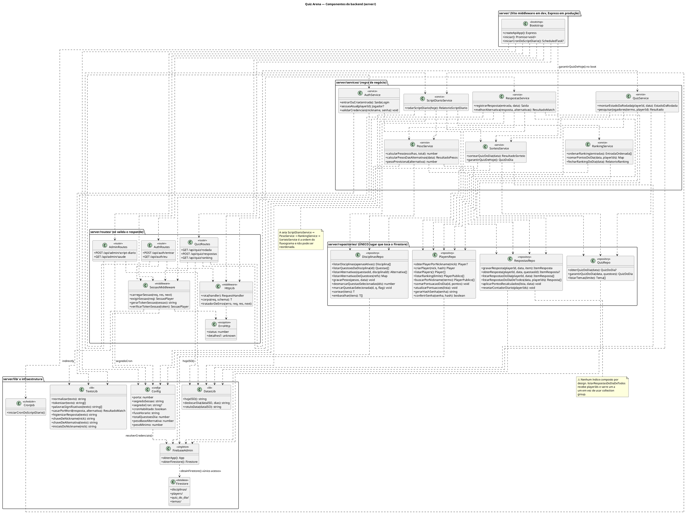

---

## 4. Modelo do frontend

`src/types/quiz.ts` espelha 1:1 o payload da API — mudar um lado exige mudar o outro.
No diagrama, os tipos do cliente aparecem como as mesmas classes do modelo de domínio
com o prefixo de tela (`Current*`).

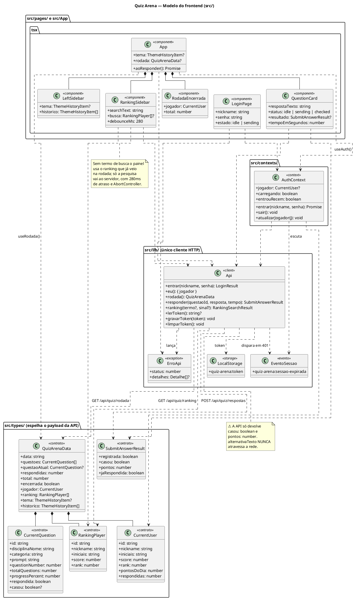

---

## 5. Sessão: entrar ou criar

`POST /api/auth/entrar` — a mesma tela serve cadastro e login, porque a regra do
fluxograma é: nickname novo é criado com a senha informada; nickname existente exige a
senha correta.

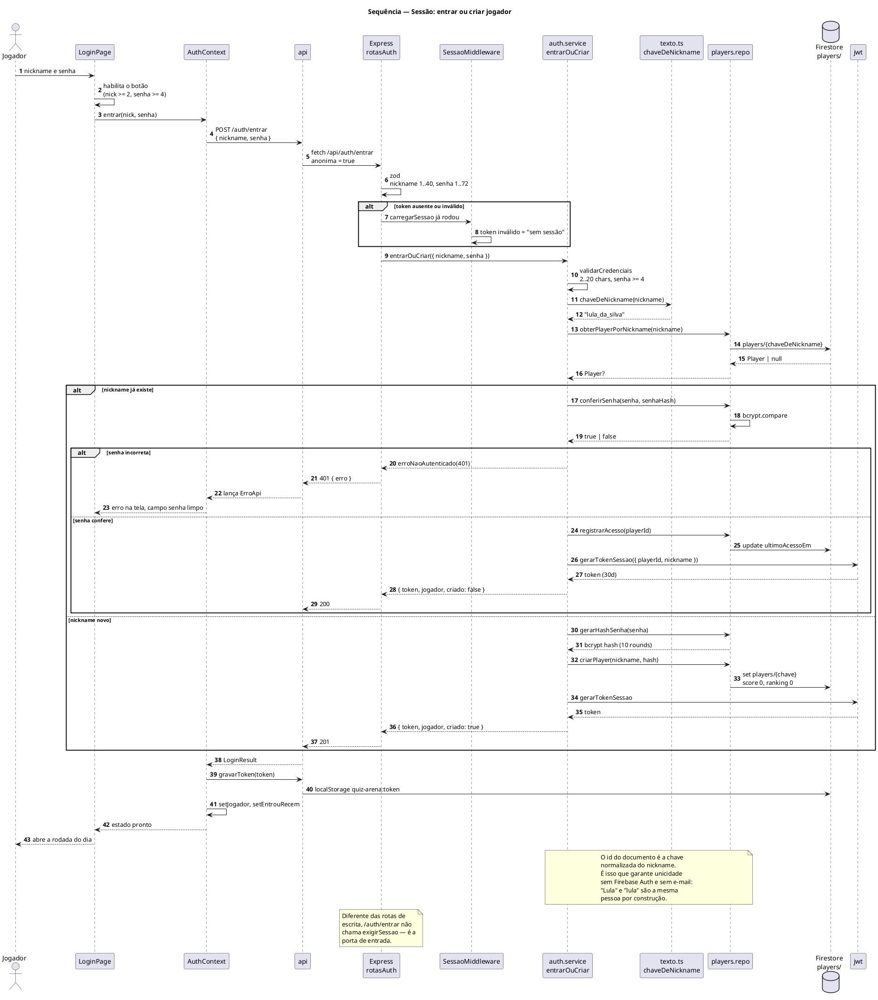

---

## 6. Rodada do dia

`GET /api/quiz/rodada` — uma chamada só devolve tema, histórico, ranking, lista de
questões e a questão da vez. É o "buscar questões do dia (7 questões)" do fluxograma.

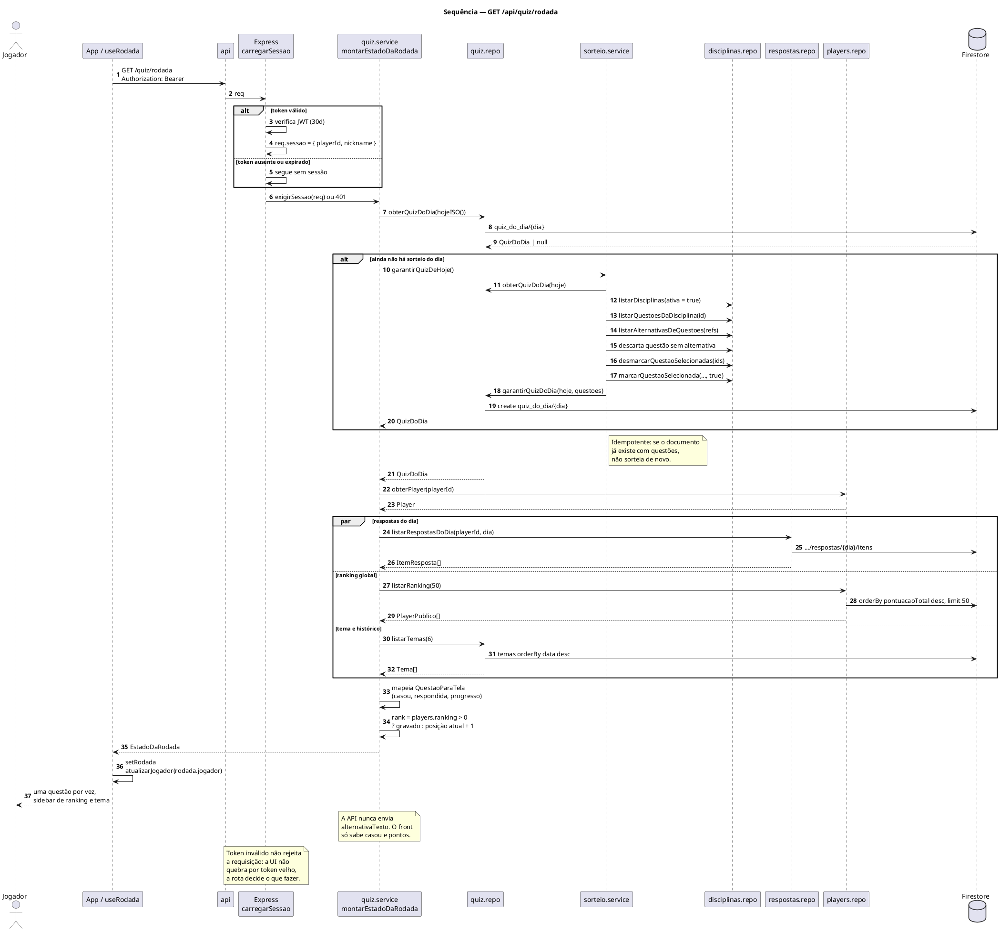

---

## 7. Resposta a uma questão

`POST /api/quiz/respostas` — o núcleo do jogo. Word match no servidor, gravação da
resposta e **fase 1** da pontuação (`pesoProvisional`).

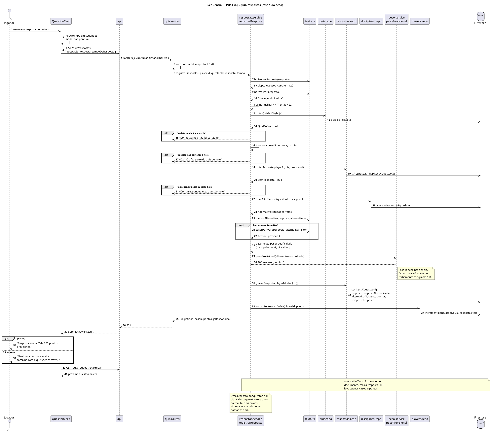

---

## 8. Motor de word match

`server/lib/texto.ts` + `respostas.service.ts`. A regra é `precisao === 1`: o jogador
pode escrever **mais** que a alternativa, nunca **menos**.

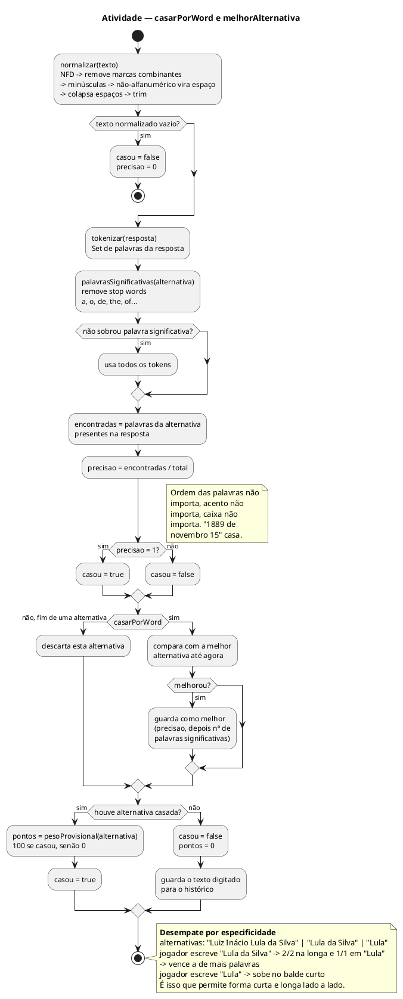

> [!danger] Não afrouxe o matcher
> A alternativa casada **é** o balde de raridade. Se match parcial passasse, o peso
> passaria a depender do desempate arbitrário entre alternativas equivalentes e
> **escrever menos renderia mais**. Apelido, abreviação e sobrenome precisam existir
> como alternativa própria ("Lula" tem precisão 0.25 contra "Luiz Inácio Lula da
> Silva"). O defeito, quando existe, é de conteúdo — não de código.

---

## 9. Script Diário — às 00h00

A seta do fluxograma é sequência obrigatória: **peso → ranking → sorteio**. O script
fecha `hoje - 1` e gera o sorteio de `hoje`.

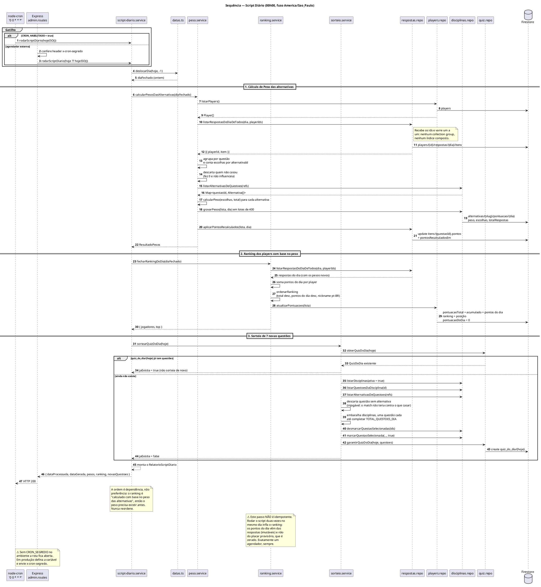

### Simular a virada

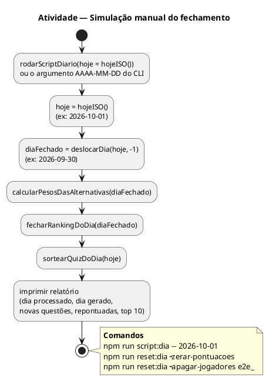

---

## 10. Peso dinâmico por raridade

Como a raridade vira pontos. A forma que menos gente escreveu vale o teto; a que todo
mundo escreveu vale o piso.

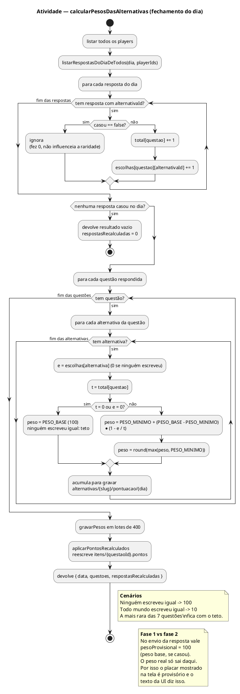

---

## 11. Ciclo de vida da rodada

Estados que a tela e o Firestore atravessam, do login ao fechamento das 00h00.

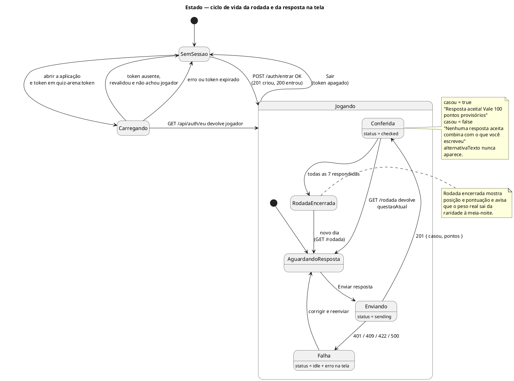

### Estado do dia no Firestore

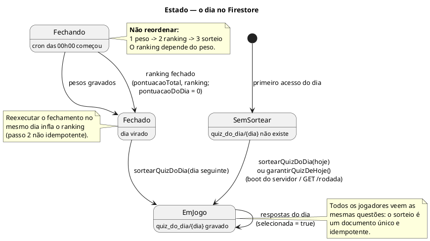

---

## 12. Componentes do sistema

As três zonas do fluxograma, com as interfaces entre elas.

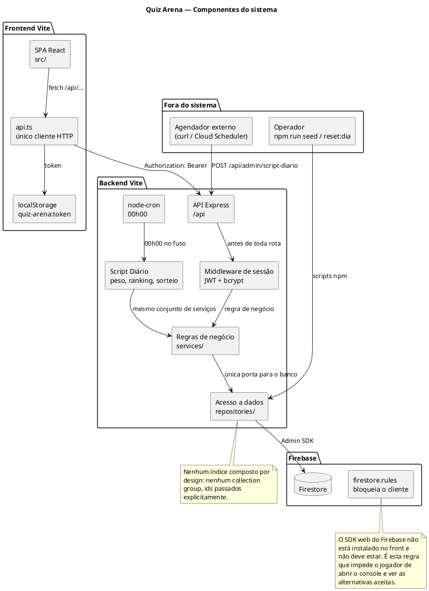

---

## 13. Implantação

Onde cada peça roda. Um site, uma porta (6767) — em desenvolvimento e em produção.

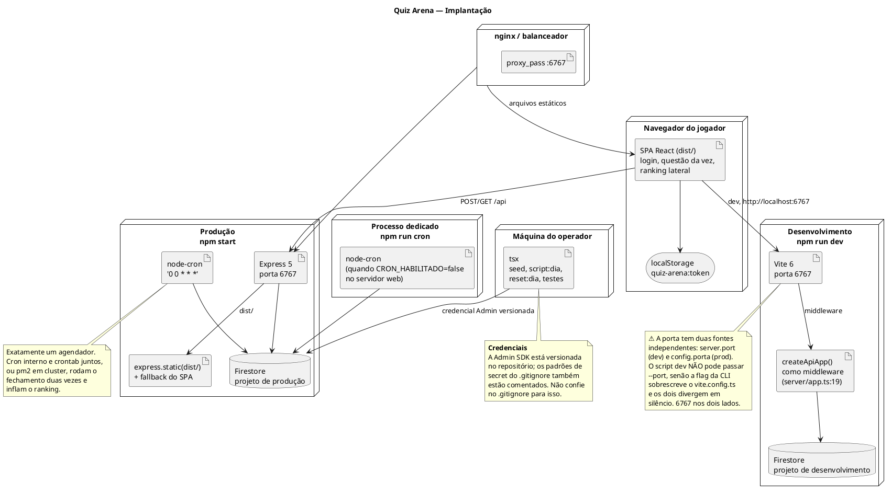

---

## Mapa: caixa do fluxograma → elemento do UML

| Caixa do fluxograma | Onde está no UML |
| --- | --- |
| **Frontend Vite** | Diagrama 12 (`SPA React`), diagrama 4 (componentes e contratos) |
| Entrada de Nickname e Senha | `UC1`, diagrama 5, `LoginPage` no diagrama 4 |
| Exibir uma questão por vez + 7 questões do dia | `UC2`/`UC5`, diagrama 6, `QuestionCard`/`RodadaEncerrada` |
| Ranking global na lateral + busca de nickname | `UC3`/`UC4`, `RankingSidebar` no diagrama 4 |
| **Backend Vite / API endpoint** | Diagrama 3 (rotas), diagrama 12 (`API Express`) |
| Salvar respostas | `UC6`, diagrama 7 |
| Buscar questões do dia | `UC5`, diagrama 6 |
| Pesquisar nickname | `UC4`, `buscarPorNickname` no diagrama 3 |
| **Script Diário 00h00 (cron)** | `UC11`, diagrama 9, `CronJob` no diagrama 13 |
| 1. Cálculo de Peso das alternativas | `UC8`, diagrama 10, `PesoService` no diagrama 3 |
| 2. Ranking (depende do peso) | `UC9`, diagrama 9, `RankingService` |
| 3. Sorteio de 7, sem repetir disciplina | `UC10`, diagrama 9, `SorteioService` |
| **Firebase / Disciplinas** | `Disciplina`, `Questao`, `Alternativa`, `Pontuacao` no diagrama 2 |
| **Firebase / Player**: ranking, nickname, senha | `Player` e `Pontuacao` no diagrama 2 |
| Respostas → `id_questao` → `tempo_de_resposta` (vermelho, TODO) | `ItemResposta` no diagrama 2, nota no diagrama 7 |
| "as respostas são sempre por extenso" / match like por word | Diagrama 8 |
| "documento de alternativas possui somente alternativas corretas" | Nota em `Alternativa` no diagrama 2 |

---

## Convenção e verificação

- Cada bloco abre com `@startuml` e fecha com `@enduml`, para o plugin renderizar
  sozinho. Sem `skinparam` compartilhado entre diagramas — cada um é independente.
- Nomes de classe e método são os reais do código, em pt-BR sem acento no
  identificador (`sortearQuizDoDia`, `casarPorWord`, `pontuacaoDoDia`).
- Ao mexer em regra de negócio, modelo de dados, fluxo de tela, rota de API ou ordem do
  Script Diário: atualize o diagrama **e** este mapa no mesmo commit do código.
- Diagramas que descrevem comportamento de temporização (10 e 11) descrevem o estado
  desejado; o comportamento real está em `server/services/peso.service.ts` e
  `server/services/script-diario.service.ts`. Se divergirem, o código ganha — e o
  diagrama precisa ser corrigido junto, sem parar para perguntar.

> [!success] Verificado com o PlantUML 1.2024.7
> Os 15 blocos passaram no `-checkonly` **e** foram renderizados para SVG.
>
> Três armadilhas do PlantUML já encontradas e corrigidas aqui, para quem for mexer
> nos diagramas depois:
>
> - `note` **solta com `bottom`** dentro de `activityDiagram` é rejeitado. Use
>   `note right` / `note left`, ou ancore a nota numa atividade.
> - `note` **não** pode ficar dentro de `alt` / `else` de `sequenceDiagram`. Mova a
>   nota para o nível de cima da lista.
> - Em `sequenceDiagram`, os ramos de `par` depois do primeiro usam `else`, não `and`.
>
> Os diagramas de classe (2, 3 e 4) abrem com `!pragma layout elk`: eles são densos
> demais e o motor Smetana (usado quando o `dot` do Graphviz não está instalado) não
> consegue dar layout neles. Se a sua versão do plugin reclamar do `!pragma`, pode
> apagar a linha — o diagrama continua válido, só o layout muda.
